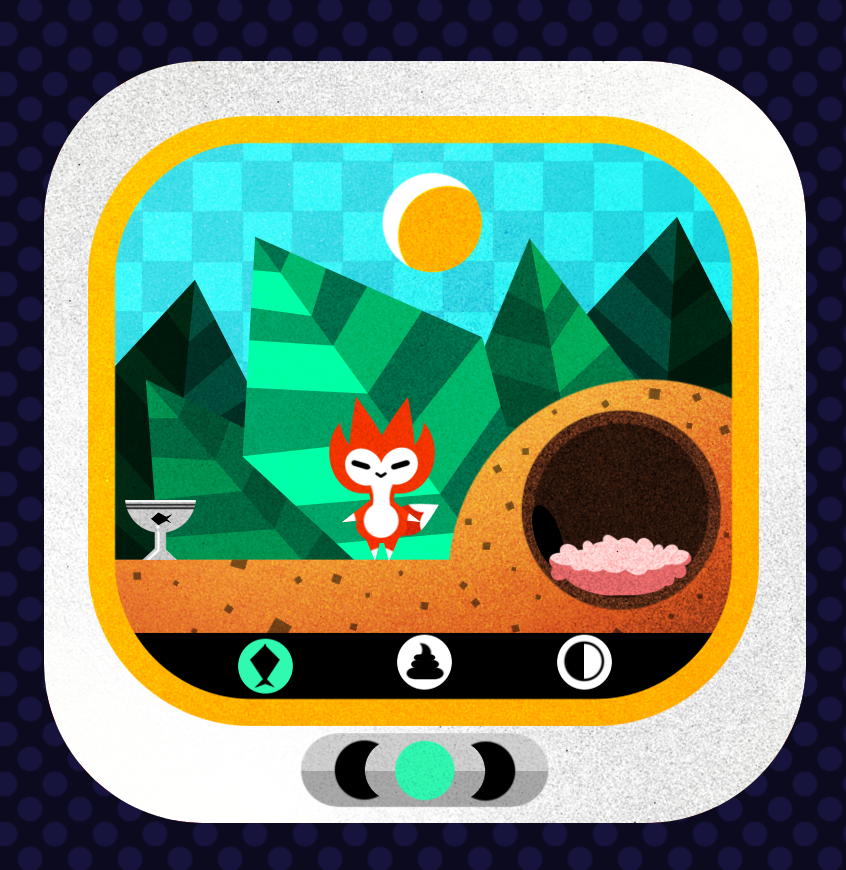

# Fox game

This is my version of a digital pet fox game from [Complete Front-End Project: Build a Game on Frontend Masters](https://frontendmasters.com/courses/front-end-game/).

## Table of contents

- [Fox game](#fox-game)
  - [Table of contents](#table-of-contents)
  - [Overview](#overview)
    - [Requirements](#requirements)
    - [Screenshot](#screenshot)
    - [Links](#links)
  - [My process](#my-process)
    - [Built with](#built-with)
    - [What I learned](#what-i-learned)
    - [Continued development](#continued-development)
    - [Useful resources](#useful-resources)
  - [Author](#author)
  - [Acknowledgments](#acknowledgments)

## Overview

### Requirements

[Requirements source from course website](https://btholt.github.io/project-fox-game-site/the-project)

- The game starts in an initialized state. The user must press the center game to get started.
- Users can switch between the three icons on the bottom using the left and right button. To press one of the icons, they will click the middle button. Users cannot directly click the icons.
- If they reach the end of the icons and try to go further (click the right button when the right-most icon is selected) it should loop around.
- When the user starts, the fox will hatch after showing the hatch animation.
- Once the fox is hatched, show the fox in an idle animation in the day time.
- The user can switch the weather from day to rain using the weather icon.
- After some amount of time the fox will become hungry. This should be on some sort of variable schedule to add some unpredictability to the game.
- The fox can only be fed when hungry.
- After a fox is a fed, after another random interval, the fox will poop.
- The fox cannot have the poop cleaned up unless there is poop to be cleaned up
- When a user cleans up poop, it should add another random interval until the fox is hungry again.
- The fox cannot be hungry and have pooped at the same time.
- If the user hasn't fed a hungry fox or clean up a fox's poop after a random interval, it should cause the fox to die and go to the game over screen.
- After a longer random interval of day/rain, it should become night. It stays night for a fixed interval. The fox does not get hungry, poop, or die in its sleep. Once it wakes up, it starts with a new random interval of hunger and poop. You cannot change the weather, clean up poop or feed a sleeping fox.
- Once the game hits nighttime, reset the timers. The fox will wake up and the first thing that will happen is it will become hungry.
- Once a fox dies, the landscape goes into the death scene, the fox becomes the tombstone, and the game is over. If the user presses the middle button again, it restarts the game with a new hatch.
- Using a modal, you should tell the user to restart the game by pressing the middle button.
- The fox should not be able to die, get hungry, poop, be fed, have the poop cleaned up, or fall asleep when it is being fed, sleeping, hatching, or dead.

### Screenshot



### Links

- Live Site: [Fox-game](https://haolzz.github.io/fox-game/index.html)

## My process

### Built with

- Sprite animation
- CSS animation using the @key-frame at-rule
- Vanilla JavaScript for game state management and DOM manupilation
- [Parcel](https://parceljs.org/) - Build bundler
- [GitHub Actions](https://github.com/features/actions) - Automatic deployment to github pages

### What I learned

1. Keyframes use a percentage to indicate the time during the animation sequence at which they take place. 0% indicates the first moment of the animation sequence, while 100% indicates the final state of the animation. Because these two times are so important, they have special aliases: _from_ and _to_.

```css
.fox-eating.fox {
  background-image: url(./pet/Eating.png);
  background-position: -1865.7px;
  background-repeat: no-repeat;
  width: 207.3px;
  height: 148px;
  top: 358px;
  left: 81px;
  animation: eating 3s steps(10);
}

@keyframes eating {
  from {
    background-position: 0;
  }
  to {
    background-position: -2073px;
  }
}
```

2. State management is achieved through a single object called gameState which contains all relevant states and actions for mutations. The `handlerUserAction` function is exported and passed to game's initilization process and needs to be bind to gameState in order for `this` to function properly.

```js
const gameState = {
  current: "INIT",
  clock: 1,
  wakeTime: -1,
  sleepTime: -1,
  scene: 0,
  hungryTime: -1,
  dieTime: -1,
  poopTime: -1,
  timeToStartCelebrating: -1,
  timeToEndCelebrating: -1,
  tick() {
    ....
  }

  handleUserAction(icon) {
    console.log("current icon is:", icon);
    if (DEAD_STATE.includes(this.current)) {
      // do nothing when in DEAD_STATE.
      return;
    }

    if (this.current === "INIT" || this.current === "DEAD") {
      this.startGame();
      return;
    }

...
};

export default gameState;
export const handleUserAction = gameState.handleUserAction.bind(gameState);
```

### Continued development

- Rewrite using TypeScript
- Refactor to Redux for state management
- Add localStorage to save game states

### Useful resources

- [CSS Animation](https://developer.mozilla.org/en-US/docs/Web/CSS/animation) - MDN's page exlaining css animation with live examples.
- [Window.requestAnimationFrame()](https://developer.mozilla.org/en-US/docs/Web/API/window/requestAnimationFrame) - MDN'documentaion about the window.requestAnimationFrame() method.

## Author

- GitHub - [Haoliang Zhang](https://github.com/HaoLZz)
- LinkedIn - [Haoliang Zhang](https://www.linkedin.com/in/haoliangzhangengineer/)

## Acknowledgments

Thanks [Brian Holt](https://github.com/btholt) for teaching this interesting course on [FrontendMasters](https://frontendmasters.com/).
